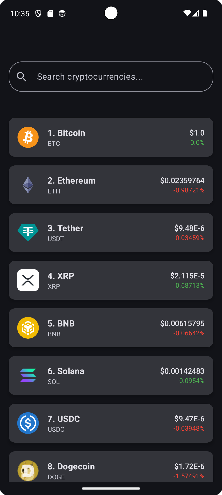
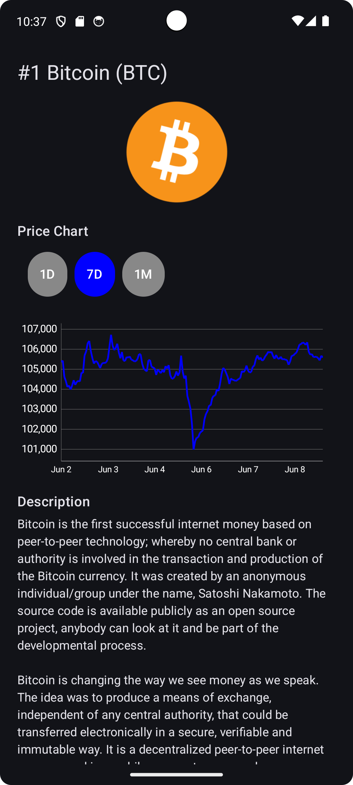
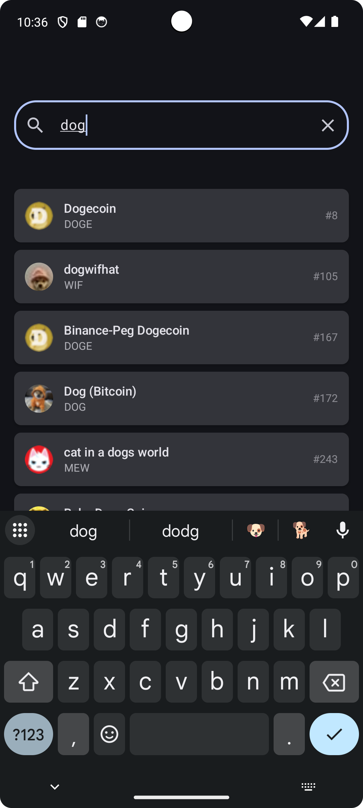

# CoinSight - Crypto Coins Tracker Android App

### 🔹 Coin List Screen 


### 🔹 Coin Detail Screen 


### 🔹 Coin Search Screen 


## App Description

CoinSight is a clean and user-friendly Android app for tracking cryptocurrency market data in real-time. Users can browse a comprehensive list of cryptocurrencies, view their current prices, market cap ranks, and 24-hour price changes. The app includes a search feature to quickly find specific coins, supports pull-to-refresh to update data, and provides network connectivity feedback.

The app leverages the CoinGecko public API for live data and is built using Jetpack Compose, Kotlin, Retrofit, and Hilt for dependency injection.

---

## Setup Instructions

### Prerequisites

- Android Studio (Arctic Fox or later recommended)
- Android SDK 31+
- Internet connection for API data fetch

### Build and Run

1. Clone this repository:

   ```bash
   git clone https://github.com/Mashnjogu/CoinSight
   cd CoinSight

## API Usage

This app uses the **CoinGecko API** to fetch cryptocurrency data. The key API endpoints used include:

### 1. Fetch Top Coins

- **Endpoint:** `GET /coins/markets`
- **Description:** Retrieves a list of top cryptocurrencies by market capitalization.
- **Parameters:**
  - `vs_currency` (default: `"btc"`) — Currency to display prices in.
  - `order` (default: `"market_cap_desc"`) — Sort order.
  - `per_page` (default: `100`) — Number of coins per page.
  - `page` (default: `1`) — Page number.
  - `sparkline` (default: `false`) — Whether to include sparkline data.
  - `price_change_percentage` (default: `"1h,24h,7d"`) — Time intervals for price change percentages.

### 2. Get Coin Details

- **Endpoint:** `GET /coins/{id}`
- **Description:** Fetch detailed information about a specific coin.
- **Parameters:**
  - `id` — Coin identifier (e.g., `"bitcoin"`).
  - Additional query options like `localization`, `tickers`, `market_data`, etc., to control returned data.

### 3. Search Coins

- **Endpoint:** `GET /search`
- **Description:** Search for coins by name or symbol.
- **Parameters:**
  - `query` — Search keyword.

### 4. Get Market Chart

- **Endpoint:** `GET /coins/{id}/market_chart`
- **Description:** Retrieve historical market data for a coin.
- **Parameters:**
  - `id` — Coin identifier.
  - `vs_currency` (default: `"usd"`) — Currency for market data.
  - `days` (default: `"7"`) — Number of days to fetch.

---

These API endpoints power the app’s ability to display cryptocurrency listings, detailed coin information, search functionality, and historical market trends.

